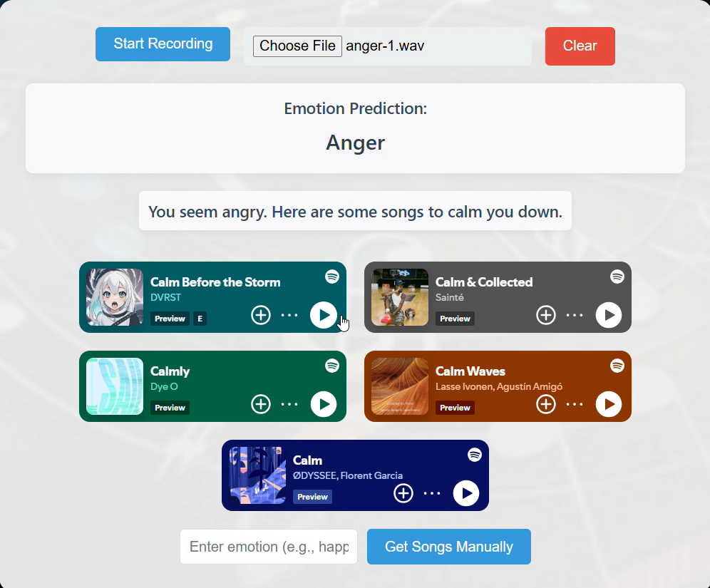
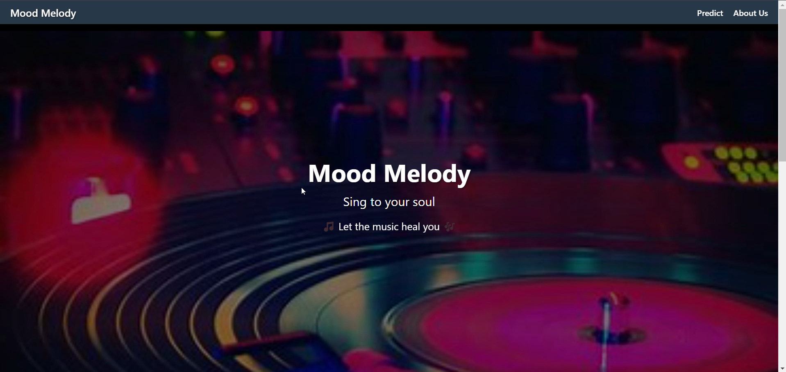
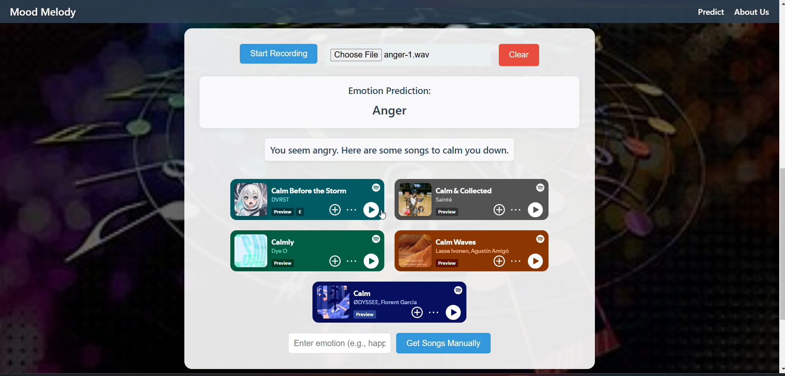

# Mood Melody: Speech Emotion Recognition and Music Recommendation
## Project Overview
**Problem Statement**: Emotions are often hard to express due to social or cultural barriers, yet our voices carry rich cues like tone and pitch that reveal unspoken feelings. This project builds a Speech Emotion Recognition (SER) system to classify emotions from speech and delivers Mood Melody, a website that detects users' emotions and recommends personalized music to enhance well-being.

**Objectives**:
- Develop an SER classifier to accurately predict emotions (e.g., happiness, sadness, anger) from audio using machine learning.
- Explore cross-lingual generalization by training on Hindi and testing on English and Kannada datasets.
- Create Mood Melody, where users can record audio, upload files, or manually input emotions to receive mood-based song suggestions.

**Technical Approach**:
- **Datasets**: Hindi (3,200 files, 8 emotions), English (600 files, 5 emotions), Kannada (~468 files, 6 emotions).
- **Features**: 175 features (MFCCs, Mel-Spectrograms, prosodic elements) extracted via Librosa.
- **Models**: Ensemble of Random Forest (87.05% accuracy), XGBoost (85.90%), and MLP Titan (76%), with majority voting boosting Mood Melody’s accuracy past 90% on Hindi data.
- **Cross-Lingual Testing**: Hindi-trained models achieved 26-40% accuracy on English/Kannada.

**Application**: Mood Melody lets users record or upload audio to detect emotions, then curates Spotify playlists (e.g., uplifting songs for sadness) using a React frontend and FastAPI backend. It blends AI with emotional well-being, with potential in therapy and empathetic tech.

**Technologies**: Python (FastAPI, TensorFlow, Librosa), React, Node.js, Spotify API.

## Demo
Click the image below to watch a demo of Mood Melody in action:

## Example Images

## Prerequisites
- Operating System: Windows, macOS, or Linux.
- Python: Version 3.8 or higher.
- Node.js: Version 16 or higher (for the frontend).
- Internet Connection: Required for installing dependencies and accessing the Spotify API.
- Git (optional): For cloning the repository.

## Installation and Setup

- All source codes are placed in the `Codes/speech-emotion-app/` folder.
- Model files and sample audio files are hosted on Google Drive: [Model](https://drive.google.com/drive/folders/1c5BsP-Fb_HBH2eWEzNloqis3zu23URxc?usp=sharing).  
Dowload this and place it in `Codes/speech-emotion-app/backend`
- The `node_modules` folder for the frontend is hosted on Google Drive due to its large size: [node_modules.zip](https://drive.google.com/drive/folders/1c5BsP-Fb_HBH2eWEzNloqis3zu23URxc?usp=sharing).    
Dowload this and place it in `Codes/speech-emotion-app/fronend`
- The `venv` folder for the backend is hosted on Google Drive due to its large size: [venv.zip](https://drive.google.com/drive/folders/1c5BsP-Fb_HBH2eWEzNloqis3zu23URxc?usp=sharing).    
Dowload this and place it in `Codes/speech-emotion-app/backend`
- Demo video link: [Demo](https://drive.google.com/file/d/1DClLh5A3PcbqrkdbCt167iVBKm756ScP/view?usp=sharing).

### Set Up the Backend
The backend uses a virtual environment with FastAPI, TensorFlow, and other dependencies.
- Navigate to the Backend Directory:
- Create a Virtual Environment: If the venv folder is missing or corrupted, create a new one
- `python -m venv venv`

- Activate the Virtual Environment

- `.\venv\Scripts\activate` 
- `pip install -r requirements.txt`
- Install Backend Dependencies: Install the required Python packages:
- `pip install fastapi uvicorn numpy pandas tensorflow librosa python-multipart`
- `pip show uvicorn`

### Setup the frontend

- Navigate to the Frontend Directory
- `install Node.js and npm:`
If not installed, download and install from nodejs.org.
Verify installation

- `node -v`
- `npm -v`

- Install Frontend Dependencies: Install the required Node.js packages
 `npm install__`
- Configure Spotify API:
Obtain a Spotify API client ID and secret from Spotify Developer Dashboard.
Create a .env file in the frontend directory with the following
- REACT_APP_SPOTIFY_CLIENT_ID=your_client_id
REACT_APP_SPOTIFY_CLIENT_SECRET=your_client_secret
- Replace your_client_id and your_client_secret with your actual Spotify API credentials

### Run the application

- Start the Backend Server: In the backend directory (with the virtual environment activated):
- `uvicorn api:app --reload --port 8000`
- Start the Frontend Server: Open a new terminal window, navigate to the frontend directory
- `npm start`
- Access the Application: Open your browser and go to http://localhost:3000. You should see the Mood Melody interface where you can:
    - Record audio to detect emotions.
    - Upload an audio file for analysis.
    - Manually input an emotion to get song recommendations.

- Note: The allow_origins is set to http://localhost:3000 to match the default React frontend port. If your frontend runs on a different port (e.g., http://localhost:3005), update this value accordingly ie,          
(if your front end port differs from http://localhost:3000 then please make the change in the api.py file present isnide the backend directory)
`app.add_middleware(`  
 `CORSMiddleware,`  
 `allow_origins=["http://localhost:3000"],`  # Adjust if your frontend port differs  
 `allow_credentials=True,`  
 `allow_methods=["*"],`  
 `allow_headers=["*"],`    
 `)`  

## Contributors

- Rochan Awasthi (https://www.linkedin.com/in/rochan-awasthi-393242302/) (https://github.com/Macbeth1501) 
- Sayali Bambal (https://www.linkedin.com/in/sayali-bambal-1a6241302/) (https://github.com/SayaiB24)

 

From CE 2nd year, St. Vincent Palloti College of Engineering and Technology, Nagpur

## License
This project is under a Proprietary License. Viewing is allowed, but copying, modifying, or distributing is strictly prohibited.
